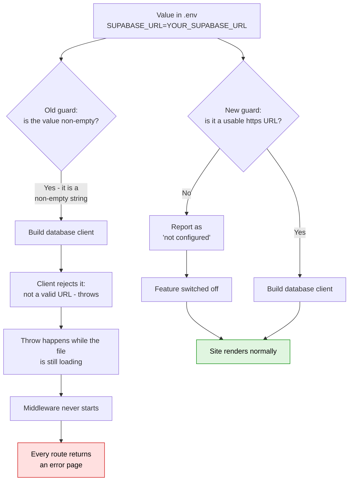
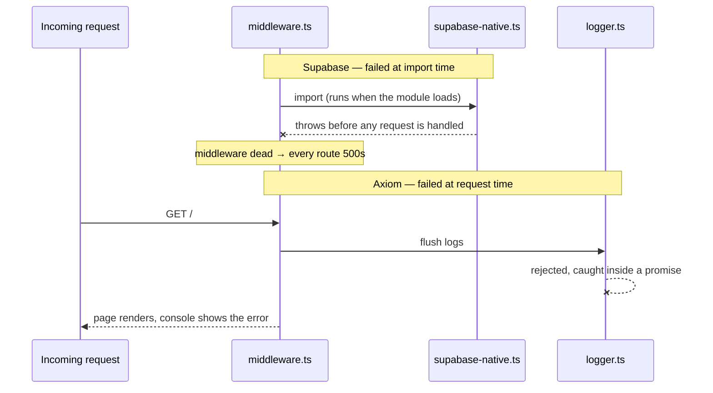

# Fresh-clone setup and environment placeholder handling

## At a glance

|                    |                                    |
| ------------------ | ---------------------------------- |
| Commits            | 2                                  |
| Files touched      | 5                                  |
| Services fixed     | 3 of 4 (Clerk was already correct) |
| Decisions recorded | 6                                  |
| Open items         | 4                                  |

The job was to write a setup skill so a non-technical person could clone this project and get
it running. Testing that skill against the project's own README uncovered a bug that made a
fresh clone unusable: the example settings file the README tells you to copy is what broke the
site. Three services were treating unfilled template values as if they were real credentials.

All three are fixed, the setup skill exists, and the README no longer tells new users to do the
thing that breaks their install. Shipped as [PR #368](https://github.com/shawn-sandy/astro-basics/pull/368).

## What changed

### 1. A guided setup skill for non-technical users

**Who it affects:** anyone being onboarded onto this project who does not write code.

Claude can now walk someone from "I was sent a link" to "the website is open in my browser"
without assuming they know git, package managers, or what an environment variable is. It checks
their machine, clones, installs, starts the site, and confirms it rendered. It also carries a
plain-language table of the failures people actually hit, so a stack trace gets translated
rather than pasted at them.

**How to reach it:** the skill lives at `.claude/skills/project-setup/SKILL.md` and triggers on
requests like "how do I set this project up".

### 2. The site no longer breaks when you copy the settings template

**Who it affects:** every person cloning the repo, including experienced developers.

Following the README exactly — `cp .env.example .env`, then start the site — used to return an
error page on **every** route. Now the site starts and runs, with the un-configured features
simply switched off.

**How to reach it:** `cp .env.example .env && npm run dev`.

### 3. Logging no longer spams the terminal on a fresh clone

**Who it affects:** anyone running the project locally without a logging account.

The app was trying to ship logs to an external service using the template's placeholder token,
producing a burst of `Error: forbidden` traces on every page load. It now falls back to console
logging silently.

### 4. The database picker no longer selects a database you never configured

**Who it affects:** anyone submitting the contact form on a fresh clone.

With template values in place, the app's automatic database selection was choosing Turso and
handing it a fake connection string on the first database operation. Turso is now correctly
seen as un-configured.

### 5. README corrected

**Who it affects:** every new contributor.

Two errors fixed: authentication was labelled **required** when the site runs fine without it,
and the placeholder guidance was missing. It now states that placeholders are safe to leave in
place.

## How it works now

_The old path (top) and the new one (bottom). The fix is the single decision point: a value that
cannot be used is now reported as absent rather than passed along._

_Why one placeholder caused an outage and the other only caused noise: where the failure fires
matters more than the failure itself._

## Before and after

| Situation                                     | Before                                   | After                                 |
| --------------------------------------------- | ---------------------------------------- | ------------------------------------- |
| Copy `.env.example` to `.env`, start the site | Error page on every route                | Site renders                          |
| No `.env` file at all                         | Site renders                             | Site renders (unchanged)              |
| Placeholder database URL                      | Treated as configured, crashes           | Treated as not configured             |
| Placeholder logging token                     | Log shipping attempted, `forbidden` spam | Console logging, silent               |
| Placeholder Turso credentials                 | Auto-selected as the active database     | Skipped as not configured             |
| Database URL with a wrong scheme (`ftp://`)   | Accepted, then crashes                   | Rejected as not configured            |
| Local Supabase on plain `http://`             | Accepted                                 | Still accepted                        |
| Turso's `libsql://` URLs                      | Accepted                                 | Still accepted                        |
| README's authentication step                  | Labelled "required"                      | Labelled optional, with what you lose |

## Decisions

**Fix the shared getter, not the call sites.** The bad value entered through one function,
`getSupabaseUrl()` in `src/utils/env-config.ts`, which four separate places consume. _Rejected:_
adding a guard at each of the three client factories plus the status check — four copies of one
rule, and the fifth caller added next year gets it wrong.

**Delete the eager export rather than make it lazy.** `supabase-native.ts` had
`export const supabaseServiceRole = getSupabaseServiceRole()`, which ran at import time despite
a comment above it claiming lazy initialisation. It had zero consumers and was not in the
package's public exports. _Rejected:_ wrapping it in a lazy getter — that preserves an API
nobody calls, and this line was the amplifier that turned a configuration mistake into a
site-wide outage.

**Validate the URL scheme, not just that it parses.** Raised by an automated reviewer and
verified before acting: `URL.canParse('ftp://example.com')` returns `true`, and the database
client accepts only `http(s)`. A scheme typo would have passed the new guard and failed in
exactly the place the guard exists to protect.

**Share the pattern across services, not the rule.** Supabase URLs must be `http(s)`; Turso's
are `libsql://`. Copying the Supabase check to Turso would have rejected every valid Turso
configuration. What generalises is "an unusable value reads as absent" — not the specific test.

**Fix Turso rather than soften the documentation.** The reviewer offered both. The setup skill
had already promised that every untouched placeholder is safe, and narrowing that to "safe
except this one" makes the document worse for the audience it was written for.

**Do not verify setup by running the test suite.** The setup skill explicitly tells Claude not
to run `npm test` or `npm run type-check` as a confirmation step, because both are red on a
clean checkout for unrelated reasons. Showing a non-technical user a wall of failures convinces
them they broke something.

## Learnings

**The bug was invisible from the source code.** Reading `src/middleware.ts` showed a correct
placeholder guard for Clerk, and it was reasonable to assume the other services matched. They
did not. Only running the documented setup in a real browser exposed it — the first draft of the
setup skill was written around a false assumption and had to be rewritten twice.

**Three of the tests passed for the wrong reason.** `src/utils/env-config.ts` memoises the
environment in a module-level cache on first import, so `vi.stubEnv` after import is silently
ignored. The initial test file asserted against an empty environment and reported green. One
failing test — the case expecting a _valid_ URL to survive — is what exposed it. The fix is to
stub, then `vi.resetModules()` and re-import. Existing suites such as
`tests/integration/clerk-supabase.test.ts` have this same stub-after-import shape and will
mislead the next person the same way.

**Every fix was checked by reintroducing the bug.** Each assertion was confirmed to go red when
the old behaviour was restored, rather than assumed to be meaningful because it was green. The
tests are also paired — each "rejects a bad value" case sits next to an "accepts a real value"
one — so broken stubbing fails loudly instead of passing vacuously.

**Red CI was not evidence of a code defect.** The failing `claude-review` check was an expired
OAuth token, established by reading the job log rather than by inspecting the diff.

**`prettier --write` on a whole file buries the real change.** Formatting the touched file
stripped trailing whitespace from eleven untouched lines, tripling the apparent diff. Reverted
and reapplied the edit by hand to keep the change reviewable.

## Open items

**The `claude-review` workflow cannot authenticate.** It fails on every push with
`API Error: 401 — OAuth access token has expired`, and `ANTHROPIC_API_KEY` is empty in the job
environment. No code change fixes this; the repo's Claude GitHub App needs re-authenticating or
the key needs setting as a repository secret. Requires account access.

**This PR has had no substantive automated review.** CodeRabbit hit its fair-usage cap and
posted a rate-limit notice instead of a review; `claude-review` cannot authenticate. Codex was
the only reviewer that actually ran. Re-triggering CodeRabbit with `@coderabbitai review` once
the limit resets would close the gap.

**43 pre-existing test failures remain untouched.** Measured, not assumed: the same 43 fail with
and without these changes, across `tests/integration/` and `tests/scripts/`. They appear to need
real database credentials. Not investigated.

**`.impeccable/hook.cache.json` is untracked.** A tool-generated cache that appeared mid-session
and was deliberately kept out of both commits. It will keep surfacing in `git status` until
someone adds it to `.gitignore`.

## Files touched

### Application code

- `src/utils/env-config.ts` — the substance of the fix. `getSupabaseUrl()` now requires a
  parseable `http(s)` URL; the Turso and Axiom getters reject their template placeholders; the
  three `is*Configured()` checks delegate to those getters so they cannot drift apart.
- `src/libs/supabase-native.ts` — removed the import-time client construction that turned a
  configuration error into a site-wide outage.

### Tests

- `tests/placeholder-env-config.test.ts` — new. Thirteen cases across Supabase, Turso, and
  Axiom, covering placeholder, empty, unparseable, wrong-scheme, and valid values.

### Documentation and tooling

- `README.md` — placeholders documented as safe to leave; authentication corrected from
  "required" to optional.
- `.claude/skills/project-setup/SKILL.md` — new. The guided setup walkthrough.

## Glossary

- **Environment variable** — a setting kept outside the code, in a file named `.env`, holding
  things like passwords and web addresses so they are not committed to the repository.
- **`.env.example`** — a template of that file, committed to the repo, with fake values such as
  `YOUR_SUPABASE_URL` standing in for the real ones. Copying it is normally the first setup step.
- **Placeholder** — one of those fake values, left unreplaced. The whole session is about what
  happens when code cannot tell a placeholder from a real setting.
- **Clerk** — the third-party service handling sign-in and user accounts.
- **Supabase** — one of the two supported databases, reached over `https://`.
- **Turso** — the other supported database, reached over `libsql://`. The project can pick
  between the two automatically.
- **Axiom** — the third-party service the app ships its logs to in production.
- **Middleware** — code that runs on every incoming request before the page is produced. If it
  fails to start, no page can be served, which is why one bad setting took down every route.
- **Import time / module load** — when a file is first read by the program, before it handles
  any request. A failure here is fatal in a way the same failure later would not be.
- **`URL.canParse`** — a built-in check for whether text is a valid web address. It accepts
  addresses like `ftp://`, which is why an extra check on the address type was needed.
- **Truthiness** — treating any non-empty text as a real value. `YOUR_SUPABASE_URL` is non-empty,
  so this check waved it through; that is the root cause of all three bugs.
- **Vacuous test** — a test that passes without actually exercising the thing it claims to check.
- **CodeRabbit / Codex / claude-review** — automated reviewers that comment on pull requests.
