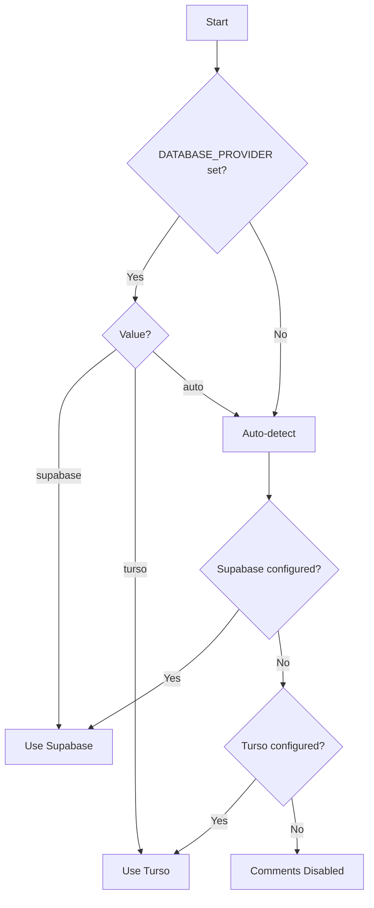

# Turso Database Support for Comments System - Implementation Plan

## Overview

This document outlines the plan to add Turso database support to the existing comments system, which currently uses
Supabase. The implementation will create a database abstraction layer allowing the application to use either
Supabase or Turso based on configuration.

## Current State Analysis

### Existing Architecture

- **Database**: Supabase (PostgreSQL) with Row-Level Security (RLS)
- **API Endpoints**: `/api/comments` with full CRUD operations
- **Schema**: Polymorphic comments supporting `post` and `doc` content types
- **Features**:
  - Threaded comments (up to 3 levels)
  - Rate limiting (5 comments/minute)
  - CSRF protection
  - Content sanitization with DOMPurify
  - Soft deletes (status: 'archived')
  - User authentication via Clerk

### Key Components

- `src/pages/api/comments.ts` - API endpoints
- `src/types/comments.ts` - TypeScript interfaces
- `src/utils/comments-availability.ts` - System availability checker
- `src/libs/supabase-server.ts` - Supabase client
- `src/libs/turso.ts` - Existing Turso client (for messages)

## Implementation Strategy

### Phase 1: Database Abstraction Layer

#### 1.1 Create Provider Interface

**File**: `src/libs/database-provider.ts`

```typescript
export interface CommentDatabaseProvider {
  getComments(params: GetCommentsParams): Promise<CommentsResult>
  createComment(params: CreateCommentParams): Promise<CommentData>
  updateComment(params: UpdateCommentParams): Promise<CommentData>
  deleteComment(params: DeleteCommentParams): Promise<void>
  getUserByClerkId(clerkId: string): Promise<User | null>
  checkAvailability(): Promise<boolean>
}
```

#### 1.2 Implement Supabase Provider

**File**: `src/libs/providers/supabase-comments.ts`

- Extract existing logic from API endpoints
- Maintain current RLS policies
- Preserve all existing functionality

#### 1.3 Implement Turso Provider

**File**: `src/libs/providers/turso-comments.ts`

- Adapt queries for SQLite syntax
- Handle UUID generation using `crypto.randomUUID()`
- Implement user synchronization from Clerk
- Use transactions for data consistency

### Phase 2: Database Schema & Migrations

#### 2.1 Turso Comments Schema

**File**: `db/migrations/002_create_comments_tables.up.sql`

```sql
-- Create users table for Clerk synchronization
CREATE TABLE IF NOT EXISTS users (
    id TEXT PRIMARY KEY,
    clerk_id TEXT NOT NULL UNIQUE,
    full_name TEXT,
    avatar_url TEXT,
    email TEXT,
    created_at DATETIME DEFAULT CURRENT_TIMESTAMP,
    updated_at DATETIME DEFAULT CURRENT_TIMESTAMP
);

-- Create comments table
CREATE TABLE IF NOT EXISTS comments (
    id TEXT PRIMARY KEY,
    content TEXT NOT NULL,
    author_id TEXT NOT NULL,
    commentable_type TEXT NOT NULL CHECK(commentable_type IN ('post', 'doc')),
    commentable_id TEXT NOT NULL,
    parent_comment_id TEXT,
    status TEXT DEFAULT 'active' CHECK(status IN ('active', 'hidden', 'archived', 'flagged')),
    is_internal INTEGER DEFAULT 0,
    organization_id TEXT DEFAULT 'serve513-beta',
    created_at DATETIME DEFAULT CURRENT_TIMESTAMP,
    updated_at DATETIME DEFAULT CURRENT_TIMESTAMP,
    FOREIGN KEY (author_id) REFERENCES users(id) ON DELETE CASCADE,
    FOREIGN KEY (parent_comment_id) REFERENCES comments(id) ON DELETE CASCADE
);

-- Create indexes for performance
CREATE INDEX idx_comments_commentable ON comments(commentable_type, commentable_id);
CREATE INDEX idx_comments_author ON comments(author_id);
CREATE INDEX idx_comments_parent ON comments(parent_comment_id);
CREATE INDEX idx_comments_status ON comments(status);
CREATE INDEX idx_comments_created_at ON comments(created_at DESC);
```

#### 2.2 Rollback Migration

**File**: `db/migrations/002_create_comments_tables.down.sql`

```sql
DROP TABLE IF EXISTS comments;
DROP TABLE IF EXISTS users;
```

### Phase 3: Configuration & Selection

#### 3.1 Database Configuration

**File**: `src/utils/database-config.ts`

```typescript
export type DatabaseProvider = 'supabase' | 'turso' | 'auto'

export function getDatabaseProvider(): DatabaseProvider {
  const provider = import.meta.env.DATABASE_PROVIDER as DatabaseProvider

  if (provider === 'supabase' || provider === 'turso') {
    return provider
  }

  // Auto-detection
  if (hasSupabaseConfig()) return 'supabase'
  if (hasTursoConfig()) return 'turso'

  return 'auto' // No database configured
}

export function getCommentProvider(): CommentDatabaseProvider | null {
  const provider = getDatabaseProvider()

  switch (provider) {
    case 'supabase':
      return new SupabaseCommentProvider()
    case 'turso':
      return new TursoCommentProvider()
    default:
      return null
  }
}
```

#### 3.2 Update Availability Checker

**File**: `src/utils/comments-availability.ts` (modifications)

- Add support for checking Turso availability
- Cache results per provider type
- Update status messages for clarity

### Phase 4: API Integration

#### 4.1 Refactor API Endpoints

**File**: `src/pages/api/comments.ts` (modifications)

```typescript
import { getCommentProvider } from '#utils/database-config'

export const GET: APIRoute = async context => {
  const provider = getCommentProvider()

  if (!provider) {
    return new Response(JSON.stringify({ error: 'Comment system unavailable' }), { status: 503 })
  }

  // Use provider methods instead of direct Supabase calls
  const comments = await provider.getComments({
    type: searchParams.get('type'),
    id: searchParams.get('id'),
    limit: parseInt(searchParams.get('limit') || '20'),
    offset: parseInt(searchParams.get('offset') || '0'),
  })

  // ... rest of implementation
}
```

#### 4.2 User Synchronization

**File**: `src/utils/sync-clerk-user.ts`

```typescript
export async function syncClerkUser(
  clerkUserId: string,
  provider: CommentDatabaseProvider
): Promise<User> {
  // Check if user exists in database
  let user = await provider.getUserByClerkId(clerkUserId)

  if (!user) {
    // Fetch user data from Clerk
    const clerkUser = await clerkClient.users.getUser(clerkUserId)

    // Create user in database
    user = await provider.createUser({
      clerk_id: clerkUserId,
      full_name: `${clerkUser.firstName} ${clerkUser.lastName}`.trim(),
      email: clerkUser.emailAddresses[0]?.emailAddress,
      avatar_url: clerkUser.imageUrl,
    })
  }

  return user
}
```

### Phase 5: Testing & Validation

#### 5.1 Test Scripts

**File**: `scripts/test-turso-comments.js`

- Test CRUD operations
- Verify threading functionality
- Check rate limiting
- Validate user synchronization

**File**: `scripts/test-database-provider.js`

- Test provider selection logic
- Verify fallback behavior
- Check error handling

#### 5.2 Migration Testing

- Test migration execution
- Verify rollback functionality
- Check data integrity

## Configuration

### Environment Variables

```env
# Database Provider Selection
# Options: 'supabase', 'turso', 'auto' (default: auto)
DATABASE_PROVIDER=auto

# Existing Supabase Configuration
SUPABASE_URL=https://...
SUPABASE_ANON_KEY=...
SUPABASE_SERVICE_ROLE_KEY=...

# Existing Turso Configuration
TURSO_DATABASE_URL=libsql://...
TURSO_AUTH_TOKEN=...

# Clerk Configuration (required for both)
PUBLIC_CLERK_PUBLISHABLE_KEY=pk_test_...
CLERK_SECRET_KEY=sk_test_...
```

### Provider Selection Logic



## Migration Path

### For New Users

1. Set `DATABASE_PROVIDER` in `.env`
2. Run appropriate migrations:
   - Supabase: Use existing migrations
   - Turso: `npm run db:migrate`
3. Comments system ready to use

### For Existing Supabase Users

- No action required (auto-detection maintains Supabase)
- Optional: Set `DATABASE_PROVIDER=supabase` explicitly

### For Users Switching to Turso

1. Export existing comments from Supabase
2. Set `DATABASE_PROVIDER=turso`
3. Run Turso migrations
4. Import comments data (migration script TBD)

## Benefits

1. **Flexibility**: Choose database based on needs
2. **Cost Optimization**: Turso for smaller projects, Supabase for scale
3. **Local Development**: Turso works better offline
4. **Backward Compatibility**: No breaking changes
5. **Maintainability**: Clean separation of concerns

## Considerations

### Database Differences

- **UUID**: Turso uses TEXT, Supabase uses UUID type
- **Timestamps**: Different default formats
- **Foreign Keys**: Must be explicitly enabled in SQLite
- **RLS**: Turso doesn't have built-in RLS (handle in application)

### Performance

- Add connection pooling for Turso
- Implement query result caching
- Consider read replicas for scale

### Security

- Implement application-level access control for Turso
- Validate all inputs at API layer
- Maintain CSRF protection
- Keep rate limiting consistent

## Timeline Estimate

- **Phase 1**: 2-3 days (Abstraction layer)
- **Phase 2**: 1 day (Schema & migrations)
- **Phase 3**: 1 day (Configuration)
- **Phase 4**: 2 days (API integration)
- **Phase 5**: 1-2 days (Testing)

**Total**: 7-10 days for complete implementation

## Future Enhancements

1. **Data Migration Tool**: Automated migration between providers
2. **Hybrid Mode**: Use both databases simultaneously
3. **Caching Layer**: Redis/Upstash for performance
4. **Real-time Updates**: WebSocket support for live comments
5. **Analytics**: Comment engagement metrics

## Success Criteria

- [ ] All existing tests pass with both providers
- [ ] No performance degradation
- [ ] Seamless provider switching
- [ ] Documentation complete
- [ ] Zero breaking changes
- [ ] Migration scripts tested

## References

- [Turso Documentation](https://turso.tech/docs)
- [LibSQL Client](https://github.com/libsql/libsql-client-ts)
- [Supabase RLS](https://supabase.com/docs/guides/auth/row-level-security)
- [SQLite Foreign Keys](https://www.sqlite.org/foreignkeys.html)
