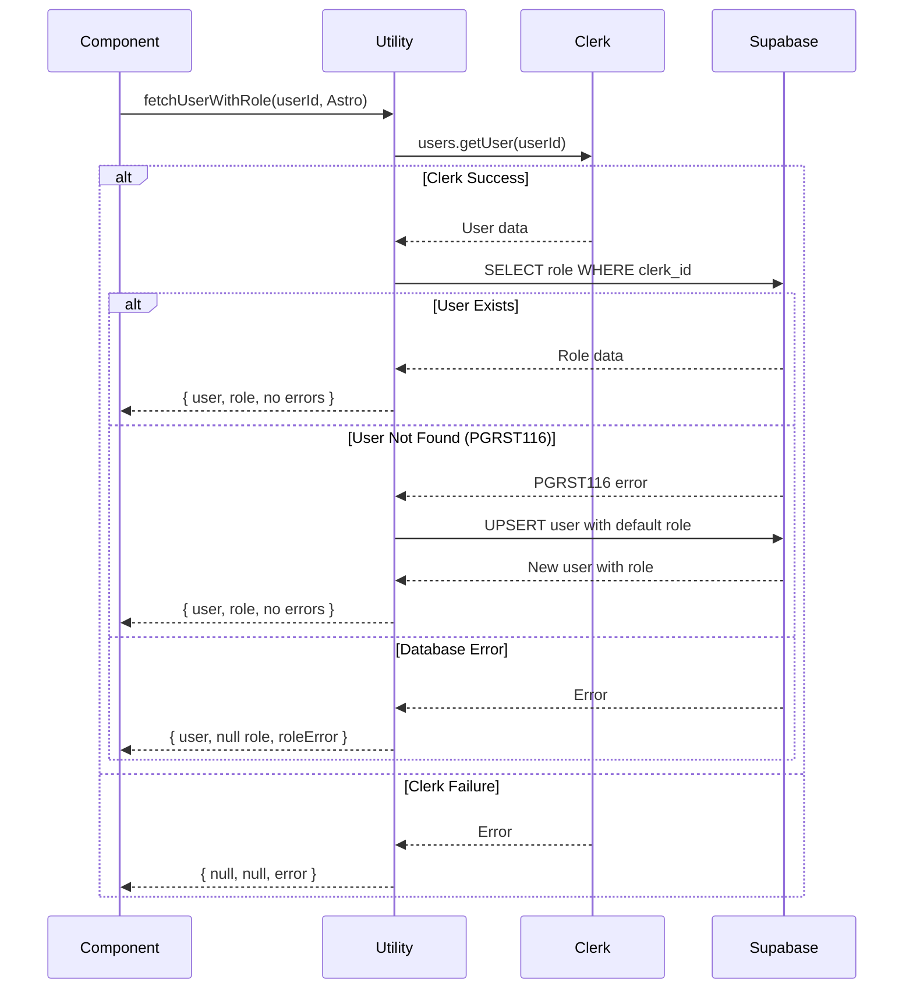

import { Tabs, TabItem, Code, Aside } from '@astrojs/starlight/components'

The **User Sync Utility** provides a consolidated, reusable function for fetching user data from Clerk and automatically syncing it with your Supabase database. It eliminates repetitive code patterns and handles edge cases like users that don't exist in the database yet.

## Quick Start

```astro
---
import { fetchUserWithRole } from '#utils/user-sync'

const { userId } = Astro.locals

if (userId) {
  const { user, userRole, error, roleError } = await fetchUserWithRole(userId, Astro)

  if (error) {
    // Handle critical error (Clerk fetch failed)
  }

  if (roleError) {
    // Handle warning (role fetch failed, but user data is available)
  }

  // Use user and userRole data
}
---
```

## Why Use This Utility?

### Before: Manual Fetching

```astro
---
import { clerkClient } from '@clerk/astro/server'
import { getSupabaseServiceRole } from '#libs/supabase-native'

const { userId } = Astro.locals

// Fetch from Clerk
let user = null
try {
  const client = clerkClient(Astro)
  user = await client.users.getUser(userId)
} catch (err) {
  console.error('Failed:', err)
}

// Fetch from Supabase
let role = null
if (user) {
  const supabase = getSupabaseServiceRole()
  const { data, error } = await supabase
    .from('users')
    .select('role')
    .eq('clerk_id', userId)
    .single()

  // Handle PGRST116 error (user not found)
  if (error && error.code === 'PGRST116') {
    // Create user manually... (30+ more lines)
  } else {
    role = data?.role
  }
}
---
```

### After: Using Utility

```astro
---
import { fetchUserWithRole } from '#utils/user-sync'

const { userId } = Astro.locals
const { user, userRole, error, roleError } = await fetchUserWithRole(userId, Astro)
---
```

**Benefits:**
- ✅ **80% less code** - One line instead of 40+
- ✅ **Automatic user creation** - Handles PGRST116 errors automatically
- ✅ **Consistent error handling** - Structured error fields
- ✅ **Race condition safety** - Uses upsert to prevent duplicates

## Function Signature

```typescript
async function fetchUserWithRole(
  userId: string,
  astroContext: AstroGlobal
): Promise<UserWithRoleResult>

interface UserWithRoleResult {
  user: ClerkUser | null
  userRole: UserRole | null
  error: string | null
  roleError: string | null
}
```

### Parameters

| Parameter | Type | Description |
|-----------|------|-------------|
| `userId` | `string` | Clerk user ID from `Astro.locals.userId` |
| `astroContext` | `AstroGlobal` | The Astro global context object |

### Return Value

The function returns an object with four fields:

| Field | Type | Description |
|-------|------|-------------|
| `user` | `ClerkUser \| null` | Clerk user object, or `null` if fetch failed |
| `userRole` | `UserRole \| null` | User's role from Supabase, or `null` if not found |
| `error` | `string \| null` | Critical error from Clerk fetch (user data unavailable) |
| `roleError` | `string \| null` | Warning from role fetch (user data available, but role missing) |

## Usage Examples

### Basic Component Usage

<Tabs>
<TabItem label="UserProfile.astro">

```astro
---
import { fetchUserWithRole } from '#utils/user-sync'
import type { User as ClerkUser } from '@clerk/backend'
import type { UserRole } from '#utils/role-types'

const { userId } = Astro.locals

let user: ClerkUser | null = null
let userRole: UserRole | null = null
let error: string | null = null
let roleError: string | null = null

if (userId) {
  const result = await fetchUserWithRole(userId, Astro)
  user = result.user
  userRole = result.userRole
  error = result.error
  roleError = result.roleError
}
---

<div class="user-profile">
  {error ? (
    <div class="error-state">
      <p>Unable to load user profile</p>
      <p class="error-details">{error}</p>
    </div>
  ) : user ? (
    <div class="profile-content">
      
      <h2>{user.fullName}</h2>
      <p>Email: {user.emailAddresses[0]?.emailAddress}</p>

      {roleError ? (
        <p class="warning">Role: Unavailable ({roleError})</p>
      ) : (
        <p>Role: <span class="role-badge">{userRole || 'member'}</span></p>
      )}
    </div>
  ) : (
    <p>Please sign in to view your profile</p>
  )}
</div>
```

</TabItem>

<TabItem label="Destructured Pattern">

```astro
---
import { fetchUserWithRole } from '#utils/user-sync'

const { userId } = Astro.locals

// Concise destructuring
const { user, userRole, error, roleError } = userId
  ? await fetchUserWithRole(userId, Astro)
  : { user: null, userRole: null, error: null, roleError: null }
---

{error && <div class="error">{error}</div>}
{!error && user && (
  <div>
    <h2>{user.fullName}</h2>
    <p>Role: {roleError ? 'N/A' : userRole}</p>
  </div>
)}
```

</TabItem>
</Tabs>

### API Endpoint Usage

```typescript
// src/pages/api/user/profile.ts
import type { APIRoute } from 'astro'
import { fetchUserWithRole } from '#utils/user-sync'

export const GET: APIRoute = async ({ locals, ...astroContext }) => {
  // Check authentication
  if (!locals.userId) {
    return new Response(
      JSON.stringify({ error: 'Unauthorized' }),
      { status: 401, headers: { 'Content-Type': 'application/json' } }
    )
  }

  // Fetch user with role
  const result = await fetchUserWithRole(locals.userId, astroContext as any)

  // Handle critical errors
  if (result.error) {
    return new Response(
      JSON.stringify({ error: result.error }),
      { status: 500, headers: { 'Content-Type': 'application/json' } }
    )
  }

  // Return successful response (with role warning if applicable)
  return new Response(
    JSON.stringify({
      user: {
        id: result.user?.id,
        email: result.user?.emailAddresses[0]?.emailAddress,
        fullName: result.user?.fullName,
        imageUrl: result.user?.imageUrl,
      },
      role: result.userRole || 'member',
      roleWarning: result.roleError || null,
    }),
    { status: 200, headers: { 'Content-Type': 'application/json' } }
  )
}
```

## Error Handling

The utility uses a **non-throwing** error design, returning errors as part of the result object rather than throwing exceptions. This allows you to handle errors gracefully in your UI.

### Error Types

<Tabs>
<TabItem label="Critical Errors (error)">

**When it occurs:**
- Clerk API fails
- Network connectivity issues
- Invalid or expired user ID
- Clerk service unavailable

**What it means:**
- User data is completely unavailable
- Cannot proceed with displaying user information

**How to handle:**
```astro
const { error } = await fetchUserWithRole(userId, Astro)

if (error) {
  // Display error page or redirect
  return <ErrorPage message="Unable to load user profile" />
}
```

</TabItem>

<TabItem label="Warnings (roleError)">

**When it occurs:**
- Supabase not configured
- Database connection failed
- User record creation failed
- Role query failed

**What it means:**
- User data IS available from Clerk
- Role information is missing or unavailable
- Page can still render with limited data

**How to handle:**
```astro
const { user, userRole, roleError } = await fetchUserWithRole(userId, Astro)

if (roleError) {
  // Log warning, but continue rendering
  console.warn('Role fetch failed:', roleError)
}

// Display with fallback role
const displayRole = userRole || 'member'
```

</TabItem>
</Tabs>

### Error Handling Best Practices

```typescript
const { user, userRole, error, roleError } = await fetchUserWithRole(userId, Astro)

// 1. Check critical errors first
if (error) {
  // Cannot proceed - show error state
  return <ErrorState />
}

// 2. Handle role warnings gracefully
if (roleError) {
  // Log for monitoring
  console.warn('Role unavailable for user:', userId, roleError)
  // But continue rendering with default role
}

// 3. Use the available data
const role = userRole || 'member' // Fallback to default
```

## Automatic User Creation

The utility automatically creates user records in Supabase when they don't exist yet. This happens when:

1. User successfully authenticates with Clerk
2. User accesses a page using this utility
3. User doesn't exist in Supabase (PGRST116 error returned)

### Default User Data

When auto-creating users, the following data is stored:

```typescript
{
  clerk_id: userId,                    // Primary key
  email: primaryEmail.emailAddress,    // Primary email from Clerk
  username: user.username,             // Clerk username (nullable)
  full_name: user.fullName,            // Full name from Clerk
  avatar_url: user.imageUrl,           // Profile image URL
  role: 'member',                      // Default role
}
```

<Aside type="tip" title="Race Condition Safety">
  The utility uses `upsert` operations to safely handle scenarios where webhooks
  and page requests might try to create the same user simultaneously. Whichever
  operation completes first wins, and the other updates the existing record.
</Aside>

### Changing Default Role

To change the default role for new users, modify the utility:

```typescript
// src/utils/user-sync.ts
const newUser = {
  // ...
  role: 'guest' as UserRole, // Change from 'member' to your preferred default
}
```

## Integration with Components

### Example: UserInfo Component

The `UserInfo.astro` component demonstrates real-world usage:

```astro
---
// src/components/astro/UserInfo.astro
import { fetchUserWithRole } from '#utils/user-sync'
import RoleBadge from '#components/react/RoleBadge.tsx'

const { userId } = Astro.locals

let user = null
let userRole = null
let error = null
let roleError = null

if (userId) {
  const result = await fetchUserWithRole(userId, Astro)
  user = result.user
  userRole = result.userRole
  error = result.error
  roleError = result.roleError
}
---

<div class="user-info">
  {error ? (
    <div class="error">{error}</div>
  ) : user ? (
    <div>
      
      <h2>{user.fullName}</h2>

      {roleError ? (
        <span class="role-error">{roleError}</span>
      ) : userRole ? (
        <RoleBadge role={userRole} client:only="react" />
      ) : (
        <span class="default-badge">Member</span>
      )}
    </div>
  ) : null}
</div>
```

## What Happens Behind the Scenes



## Comparison with Other Approaches

### vs. Manual Fetching

| Feature | Manual Fetching | User Sync Utility |
|---------|----------------|-------------------|
| Lines of Code | 40-60 lines | 1 line |
| Error Handling | Custom per component | Consistent, built-in |
| Auto User Creation | Must implement manually | Automatic |
| Race Condition Safety | Must handle manually | Built-in upsert |
| Maintenance | Update all components | Update once in utility |

### vs. API Endpoint

Using `/api/user/sync`:

**Pros:**
- Explicit control over sync timing
- Can be called from client-side

**Cons:**
- Extra HTTP request (slower)
- Requires separate endpoint maintenance
- More complex error handling

**When to use each:**
- Use **`fetchUserWithRole`** for server-rendered pages (most cases)
- Use **`/api/user/sync`** for client-side data fetching or manual sync triggers

### vs. Webhooks Only

Relying solely on Clerk webhooks:

**Pros:**
- Proactive user creation
- Real-time updates

**Cons:**
- Requires webhook configuration
- Potential delays or failures
- No fallback if webhook misses

**Best approach:** Use both
- Webhooks for proactive sync
- `fetchUserWithRole` as safety net/fallback

## Troubleshooting

### "Failed to load user information"

**Cause:** Clerk API call failed

**Solutions:**
1. Verify `CLERK_SECRET_KEY` in `.env`
2. Check Clerk service status
3. Verify `userId` is valid
4. Check network connectivity

### "Database not configured"

**Cause:** Supabase environment variables missing

**Solutions:**
1. Run `npm run db:wizard` to configure
2. Manually add to `.env`:
   ```env
   SUPABASE_URL=https://your-project.supabase.co
   SUPABASE_SERVICE_ROLE_KEY=your-service-role-key
   ```

### "Role information unavailable"

**Cause:** Supabase query failed or user creation failed

**Solutions:**
1. Check Supabase credentials
2. Verify `users` table exists
3. Check service role permissions
4. Review Supabase logs for specific error

### User Created with Wrong Role

**Cause:** Default role is `'member'`

**Solution:** Update role in Supabase:

```sql
UPDATE users
SET role = 'admin'
WHERE clerk_id = 'user_...';
```

Or create an admin API to update roles programmatically.

## Related Resources

- [Clerk-Supabase Integration Setup](/guide/getting-started/authentication)
- [Configurable Roles System](/guide/configurable-roles)
- [Database Switching Guide](/guide/database-switching)
- [Environment Configuration](/guide/environment-configuration)

## Next Steps

1. **Review the implementation**: Check [`src/utils/user-sync.ts`](https://github.com/your-repo/blob/main/src/utils/user-sync.ts)
2. **See it in action**: Look at [`src/components/astro/UserInfo.astro`](https://github.com/your-repo/blob/main/src/components/astro/UserInfo.astro)
3. **Extend it**: Add caching, custom role mapping, or batch fetching
4. **Contribute**: Submit improvements via pull request

---

**Have questions?** Open an issue on [GitHub](https://github.com/your-repo/issues) or check the [authentication guide](/guide/getting-started/authentication).
